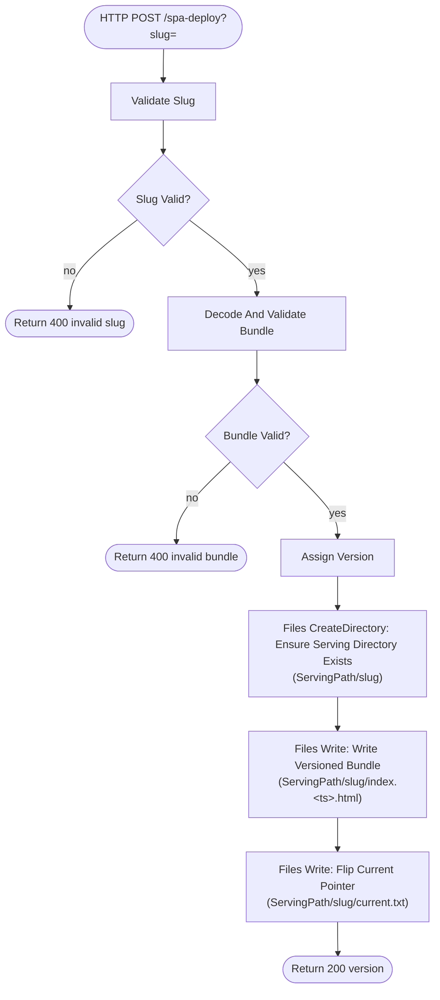

# Build Spec: Deploy SPA Bundle

## Overview
 
`Deploy SPA Bundle` is a Frends-protected HTTP `POST` Process that receives a base64-encoded single-file SPA bundle from CI for a **required target slug** (the `?slug=` query parameter), validates the slug and the bundle, writes the bundle to a unique versioned filename **inside that slug's subdirectory**, and flips that slug's `current.txt` pointer last. The per-slug pointer flip is the atomic commit: the serving Process for that slug never sees a partially uploaded bundle, and deploying one slug never touches another slug's active bundle.

Hosting is slug-addressed: `spa.ServingPath` is the **parent** directory holding one subdirectory per slug (`{spa.ServingPath}/{slug}/`). The slug travels as a query parameter so the `text/plain` base64 body contract is unchanged. The frozen wire contract lives in [`../README.md`](../README.md) (Interface Contract); this Process is one side of that seam.

## Intent Coverage Matrix

| Class | Requirement | Implemented by | Builder assertion |
|---|---|---|---|
| Functional | Receive deploy uploads via Frends API Policy protected HTTP POST | HTTP Trigger `Start`, `httpMethod=POST`, `routeTemplate=spa-deploy`, `auth=ApiPolicy`, `corsEnabled=false` | `mustBeTriggerType=http`, `configEquals` |
| Functional | Read the required `slug` query parameter (missing slug treated as invalid) | Script `Validate Slug` reading `#trigger.data.queryParameters["slug"]` | `expressionContains=queryParameters`, `element=Validate Slug` |
| Functional | Validate slug against `^[a-z0-9-]+$` before any file write | Script `Validate Slug`, Decision `Slug Valid?` | `element=Slug Valid?`, `mustBeType=decision` |
| Functional | Reject missing/invalid slug with `400 {"error":"invalid slug"}`, no writes | Return `Return Invalid Slug` on the Decision default branch | `parameterContains=invalid slug`, `httpStatusCode=400` |
| Functional | Decode `#trigger.data.httpBody` once from base64 | Script `Decode And Validate Bundle` | `expressionContains=FromBase64String(#trigger.data.httpBody)` |
| Functional | Validate marker and size limit, independent of slug | Script `Decode And Validate Bundle`, Decision `Bundle Valid?` | `element=Bundle Valid?`, `mustBeType=decision` |
| Functional | Ensure the slug's serving subdirectory exists before any file write | Task `Ensure Serving Directory Exists` | `mustUsePackage=Frends.Files.CreateDirectory`, `parameterContains=#var.slug.Value` |
| Functional | Write unique versioned bundle into the slug subdirectory before pointer flip | Task `Write Versioned Bundle` after `Ensure Serving Directory Exists` | `mustUsePackage=Frends.Files.Write`, `parameterContains=WriteBehaviour=Throw` |
| Functional | Flip the slug's pointer last | Task `Flip Current Pointer` after `Write Versioned Bundle` | `mustUsePackage=Frends.Files.Write`, `parameterContains=WriteBehaviour=Overwrite` |
| Functional | Return installed version on success | Return `Return Deployed` | `parameterContains=version` |
| Scope control | Slug isolation — deploying one slug never affects another | All write paths are scoped to `#env.spa.ServingPath + "/" + #var.slug.Value` | No write touches the parent or a sibling slug |
| Scope control | Authentication is not implemented inside the Process | Frends API Management / API Policy | No `x-api-key` Script or authorization Decision in the Process |
| Scope control | Retry is not implemented inside the Process | CI/client retries | No Task retry metadata |
| Scope control | DLQ-equivalent persistence is not implemented inside the Process | Frends instance logs and HTTP failure response | No Shared State write |

## Prerequisites

- Development Environment ID: `51`.
- Development Agent Group ID: `51`, internal name `Default`.
- Task packages installed in the tenant: live catalog resolves `Frends.Files.CreateDirectory` as `Frends.Files.CreateDirectory.1.1.0` and `Frends.Files.Write` as `Frends.Files.Write.1.3.0`.
- The Agent can create/write `spa.ServingPath`; Development default is `/frends-data/spa`.
- Frends API Management policy protects `POST /spa-deploy`; any deploy credential belongs to API Management, not to this Process.

## Environment Variables

| Name | Type | Purpose | Referenced in | Development |
|---|---|---|---|---|
| `spa.ServingPath` | String | **Parent** directory holding one subdirectory per slug; write paths are `{spa.ServingPath}/{slug}/...` | `Ensure Serving Directory Exists`, `Write Versioned Bundle`, `Flip Current Pointer` | `/frends-data/spa` |
| `spa.CurrentPointer` | String | Per-slug pointer filename whose contents identify the active bundle for that slug | `Flip Current Pointer` | `current.txt` |
| `spa.MaxBundleBytes` | Number | Max decoded bundle byte count | `Decode And Validate Bundle` | `5242880` |

The slug itself is **not** an Environment Variable — there is no `spa.DefaultSlug`. It is supplied per request as the `?slug=` query parameter and validated against `^[a-z0-9-]+$` (lowercase alphanumeric and hyphen, no separators, no `..`).

## Process Definition

**Triggered by:** HTTP Trigger `POST /spa-deploy`  
**Agent Group:** Development `Default`  
**Called Subprocesses:** None  
**Returns:** HTTP JSON result.

### Resilience & Retry Policy

No internal retry is configured. The CI/client caller owns retry behavior. If a write fails, the Frends Task fails the Process instance and the HTTP request receives a failure response.

### Failure Routing & DLQ

No DLQ-equivalent Shared State write is configured. Frends instance logs and the HTTP response are the operational failure signal.

| Failure mode | Detected by | Response |
|---|---|---|
| Missing or invalid API credential | Frends API Management policy | Frends gateway `401`/`403`; Process does not start |
| Missing `slug` query parameter or slug failing `^[a-z0-9-]+$` | `Validate Slug` and Decision `Slug Valid?` | Process returns `400 {"error":"invalid slug"}`; no file writes |
| Invalid base64, empty bundle, missing marker, or oversize | `Decode And Validate Bundle` and Decision `Bundle Valid?` | Process returns `400 {"error":"invalid bundle"}`; no file writes |
| Directory creation, versioned write, or pointer write fails | `Frends.Files.CreateDirectory` or `Frends.Files.Write` Task exception | Process fails; Frends logs the error; caller receives failure response |

### Idempotency & Delivery Semantics

- **Delivery semantics:** at-least-once for client retries.
- **Dedup key:** versioned filename generated from UTC timestamp to millisecond precision.
- **Safe to replay?:** yes. Replays create a new immutable version and pointer overwrite is the final commit.
- **Atomicity:** old version remains active unless both writes succeed and the pointer flip completes.

### Observability

- Frends logs the Process instance and Task error details.
- API Management handles unauthorized requests before the Process starts.
- Successful responses include the deployed version filename.

### Parameterization Inventory

| Value class | Used by | Environment Variable | Notes |
|---|---|---|---|
| Serving parent path | Directory creation and file write paths | `#env.spa.ServingPath` | Per Environment |
| Target slug | Subdirectory for every write path | `?slug=` query parameter (`#var.slug.Value`) | Per request |
| Pointer filename | Pointer write path | `#env.spa.CurrentPointer` | Per Environment |
| Bundle byte limit | Validation script | `#env.spa.MaxBundleBytes` | Tunable |

### Flow Diagram

### Trigger Configuration

**Trigger:** HTTP Trigger
- **Display name:** `Start`
- **HTTP method:** `POST`
- **Route template:** `spa-deploy` (slug travels as the `?slug=` query parameter, not a route segment)
- **Allowed schemes:** `HTTPS`
- **Authentication:** `API Policy`
- **CORS:** disabled; allowed origins empty
- **Public:** off/private (`isPrivate=true`, `isPublic=false`)

### Shape Sequence

1. **Trigger:** `Start` — HTTP `POST /spa-deploy?slug=<slug>`
2. **Script:** `Validate Slug`
   - Reads `#trigger.data.queryParameters["slug"]` (missing key → empty → invalid).
   - Validates `^[a-z0-9-]+$` with `System.Text.RegularExpressions.Regex.IsMatch`.
   - Assigns variable `slug` = `{ IsValid, Value }`.
3. **Exclusive Decision:** `Slug Valid?`
   - Condition: `#var.slug.IsValid == true`
   - No/default: `Return Invalid Slug`
4. **Script:** `Decode And Validate Bundle`
   - Decodes `#trigger.data.httpBody` with `System.Convert.FromBase64String`.
   - Validates non-empty HTML, marker `id="app"`, and byte count <= `#env.spa.MaxBundleBytes`.
   - Assigns variable `bundle`. (Bundle validation is independent of the slug.)
5. **Exclusive Decision:** `Bundle Valid?`
   - Condition: `#var.bundle.IsValid == true`
   - No/default: `Return Invalid Bundle`
6. **Assign Variable:** `Assign Version`
   - Variable: `version`
   - Expression: `"index." + System.DateTime.UtcNow.ToString("yyyyMMdd'T'HHmmssfff'Z'") + ".html"`
7. **Task:** `Ensure Serving Directory Exists`
   - `Frends.Files.CreateDirectory`
   - `Directory=#env.spa.ServingPath + "/" + #var.slug.Value`
   - Creates the slug subdirectory (and parents) unless it already exists.
8. **Task:** `Write Versioned Bundle`
   - `Frends.Files.Write`
   - `Content=#var.bundle.Html`
   - `Path=#env.spa.ServingPath + "/" + #var.slug.Value + "/" + #var.version`
   - UTF-8, no BOM, `WriteBehaviour=Throw`
9. **Task:** `Flip Current Pointer`
   - `Frends.Files.Write`
   - `Content=#var.version`
   - `Path=#env.spa.ServingPath + "/" + #var.slug.Value + "/" + #env.spa.CurrentPointer`
   - UTF-8, no BOM, `WriteBehaviour=Overwrite`
10. **Return:** `Return Deployed`
    - HTTP `200`, `application/json`, content `{"version":"<filename>"}`

### Return Value

- `Return Deployed`: HTTP `200`, `application/json`, content `{"version":"<filename>"}`.
- `Return Invalid Slug`: HTTP `400`, `application/json`, content `{"error":"invalid slug"}` — missing or out-of-charset slug, no file writes.
- `Return Invalid Bundle`: HTTP `400`, `application/json`, content `{"error":"invalid bundle"}` — bad base64 / empty / missing marker / oversize, no file writes.
- Directory creation and file write failures are unhandled Process failures by design; Frends logs the Task error and the client receives the runtime failure response.

## Test Plan

1. Import with `--conflict NewVersion` and deploy to Development Agent Group `51` with active triggers.
2. Verify the deployment shows as `Deploy SPA Bundle`, same process GUID, newest build version.
3. Call the endpoint without a valid Frends API Management key and expect gateway `401`/`403`; no Process execution should be logged.
4. Call `POST /spa-deploy` (valid key) with **no `slug`** query parameter; expect HTTP `400 {"error":"invalid slug"}` and no file writes.
5. Call `POST /spa-deploy?slug=../bad` (valid key, valid bundle); expect HTTP `400 {"error":"invalid slug"}` and no file writes.
6. Call `POST /spa-deploy?slug=intake-form` (valid key) with base64 HTML missing `id="app"`; expect HTTP `400 {"error":"invalid bundle"}`.
7. Call `POST /spa-deploy?slug=intake-form` (valid key) with minimal valid base64 HTML containing `id="app"`; expect HTTP `200` with `{"version":"index.<timestamp>.html"}`, and the file written under `/frends-data/spa/intake-form/` with `current.txt` flipped there.
8. Deploy a second slug (`?slug=approvals`) and confirm `intake-form`'s active bundle and pointer are unchanged (isolation).
