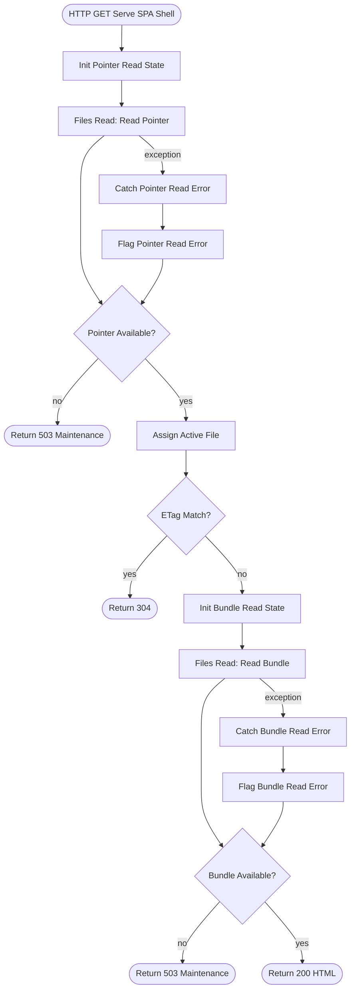

# Build Spec: Serve SPA Shell

## Overview

`Serve SPA Shell` is a public HTTP `GET` Process that returns the active single-file SPA
bundle as `text/html`. Because it serves the browser-facing SPA shell, the API
Management policy allows public access — no API key is required. It reads the pointer
file written by `Deploy SPA Bundle`, reads the active bundle, supports
`ETag`/`If-None-Match`, and returns a short `503` maintenance page if the pointer or
bundle cannot be read.

## Intent Coverage Matrix

| Class | Requirement | Implemented by | Builder assertion |
|---|---|---|---|
| Functional | Expose a public (no API key) HTTP GET serving endpoint | HTTP Trigger `Serve SPA Shell`, `httpMethod=GET`, `routeTemplate=ui`, `auth=ApiPolicy` (policy `allowPublicAccess=true`), `corsEnabled=false` | `mustBeTriggerType=http`, `configEquals` |
| Functional | Read the pointer file to determine the active bundle | Task `Read Pointer` | `mustUsePackage=Frends.Files.Read`, `mustParameterize=Path` |
| Functional | Convert pointer contents into active filename | Assign Variable `Assign Active File` | `expressionContains=.Content.Trim()` |
| Functional | Return `304` when client ETag matches active filename | Decision `ETag Match?`, Return `Return Not Modified` | `mustBeType=decision`, `parameterContains=ETag` |
| Functional | Read the active bundle file | Task `Read Bundle` | `mustUsePackage=Frends.Files.Read`, `mustParameterize=Path` |
| Functional | Return bundle HTML with caching headers | Return `Serve HTML` | `parameterContains=text/html; charset=utf-8` |
| Functional | Return maintenance HTML when pointer read fails | Catch `Catch Pointer Read Error`, Decision `Pointer Available?`, Return `Return Pointer Maintenance` | `mustHaveFailurePolicy=true` |
| Functional | Return maintenance HTML when bundle read fails | Catch `Catch Bundle Read Error`, Decision `Bundle Available?`, Return `Return Bundle Maintenance` | `mustHaveFailurePolicy=true` |
| Scope control | Keep the Process small | Single Process, no business Subprocess calls, no hashing, no durable DLQ write | No extra runtime shapes beyond read/catch/decision/return |
| NFR | Minimal retry before read failure routing | `Read Pointer` and `Read Bundle` have one retry | `mustHaveRetry=true` |
| NFR | Failure route for every I/O step | Direct task-level Catch after each `Files Read` | `mustHaveFailurePolicy=true` |
| NFR | DLQ-equivalent for synchronous read failures | HTTP `503` maintenance response | `mustHaveDlqRoute=true` |
| Scope control | No global handler | Expected read failures are handled in-flow with `503`; no unhandled-error Subprocess is configured | Not asserted |

## Prerequisites

- Task package installed in the tenant: `Frends.Files.Read` 1.2.0.
- Environment Variables:

| Name | Type | Purpose | Development |
|---|---|---|---|
| `spa.ServingPath` | String | Directory holding versioned bundles and pointer file | `/frends-data/spa` |
| `spa.CurrentPointer` | String | Pointer filename whose contents identify the active bundle | `current.txt` |

## Process Definition

**Triggered by:** HTTP Trigger `GET /ui`  
**Called business Subprocesses:** None  
**Unhandled-error Subprocess:** None  
**Returns:** HTTP HTML result or `304`.

### Resilience & Retry Policy

Each `Frends.Files.Read` Task retries once for transient shared-volume read blips. After
the retry, the direct Catch path returns `503` maintenance HTML.

### Failure Routing & DLQ

This Process is a synchronous read endpoint. It does not write a durable DLQ record; the
`503` maintenance response is the DLQ-equivalent failure signal for callers, and Frends
instance logs capture the execution.

| Failure mode | Detected by | Response |
|---|---|---|
| Pointer file missing/unreadable | Catch after `Read Pointer` | `503` maintenance HTML |
| Active bundle missing/unreadable | Catch after `Read Bundle` | `503` maintenance HTML |
| Client has current ETag | `ETag Match?` | `304` with `ETag` and `Cache-Control` |
| Normal request | Success path | `200` `text/html` with `ETag` and `Cache-Control` |

### Idempotency & Delivery Semantics

`GET /ui` is read-only. It does not mutate files, Environment Variables, or Process
state.

### Observability

Frends logs the Process instance and Task failures. Expected unavailable states return
`503` instead of exposing a stack trace.

### Parameterization Inventory

| Value class | Used by | Environment Variable |
|---|---|---|
| Serving path | `Read Pointer`, `Read Bundle` | `#env.spa.ServingPath` |
| Pointer filename | `Read Pointer` | `#env.spa.CurrentPointer` |

### Flow Diagram

### Trigger Configuration

**Trigger:** HTTP Trigger
- **Display name:** `Serve SPA Shell`
- **HTTP method:** `GET`
- **Route template:** `ui`
- **Allowed schemes:** `HTTPS`
- **Authentication:** `API Policy` with public access (`allowPublicAccess=true`); no API
  key required.
- **CORS:** disabled; allowed origins empty
- **Public:** on (`isPublic=true`, `isPrivate=false`) for anonymous browser access through
  the API Management policy.

### Shape Sequence

1. **Expression:** `Init Pointer Read State`
   - Variable: `pointerReadFailed`
   - Expression: `false`
2. **Task:** `Read Pointer`
   - Package: `Frends.Files.Read`
   - `input.Path=#env.spa.ServingPath + "/" + #env.spa.CurrentPointer`
   - `options.FileEncoding=UTF8`
   - Retry once, then Catch.
3. **Catch:** `Catch Pointer Read Error`
   - Variable: `pointerError`
   - Child Assign Variable `Flag Pointer Read Error` sets `pointerReadFailed=true`.
4. **Decision:** `Pointer Available?`
   - Condition: `#var.pointerReadFailed == false`
   - No/default: `Return Pointer Maintenance`
5. **Expression:** `Assign Active File`
   - Variable: `activeFile`
   - Expression: `#result[Read Pointer].Content.Trim()`
6. **Decision:** `ETag Match?`
   - Condition: `#trigger.data.httpHeaders.ContainsKey("If-None-Match") && #trigger.data.httpHeaders["If-None-Match"] == "\"" + #var.activeFile + "\""`
   - Yes: `Return Not Modified`
   - No/default: read the bundle.
7. **Expression:** `Init Bundle Read State`
   - Variable: `bundleReadFailed`
   - Expression: `false`
8. **Task:** `Read Bundle`
   - Package: `Frends.Files.Read`
   - `input.Path=#env.spa.ServingPath + "/" + #var.activeFile`
   - `options.FileEncoding=UTF8`
   - Retry once, then Catch.
9. **Catch:** `Catch Bundle Read Error`
   - Variable: `bundleError`
   - Child Assign Variable `Flag Bundle Read Error` sets `bundleReadFailed=true`.
10. **Decision:** `Bundle Available?`
    - Condition: `#var.bundleReadFailed == false`
    - Yes: `Serve HTML`
    - No/default: `Return Bundle Maintenance`

### Return Values

- `Serve HTML`: HTTP `200`, content `#result[Read Bundle].Content`, content type
  `text/html; charset=utf-8`, headers `ETag` and `Cache-Control: no-cache`.
- `Return Not Modified`: HTTP `304`, empty content, headers `ETag` and
  `Cache-Control: no-cache`.
- `Return Pointer Maintenance` and `Return Bundle Maintenance`: HTTP `503`, short HTML
  maintenance page, header `Retry-After: 10`.

## Test Plan

1. Import with `--conflict NewVersion` and deploy to Development with active triggers.
2. Ensure `Deploy SPA Bundle` has run once so the pointer and active bundle exist.
3. Call `GET /api/ui` without `If-None-Match`; expect HTTP `200`, `text/html`, body is
   the bundle, `ETag` present, `Cache-Control: no-cache`.
4. Call `GET /api/ui` with `If-None-Match` equal to the returned ETag; expect HTTP `304`
   and an empty body.
5. Temporarily point `spa.CurrentPointer` to a missing file or clear the serving path in
   Development; expect HTTP `503` maintenance HTML and no stack trace.
